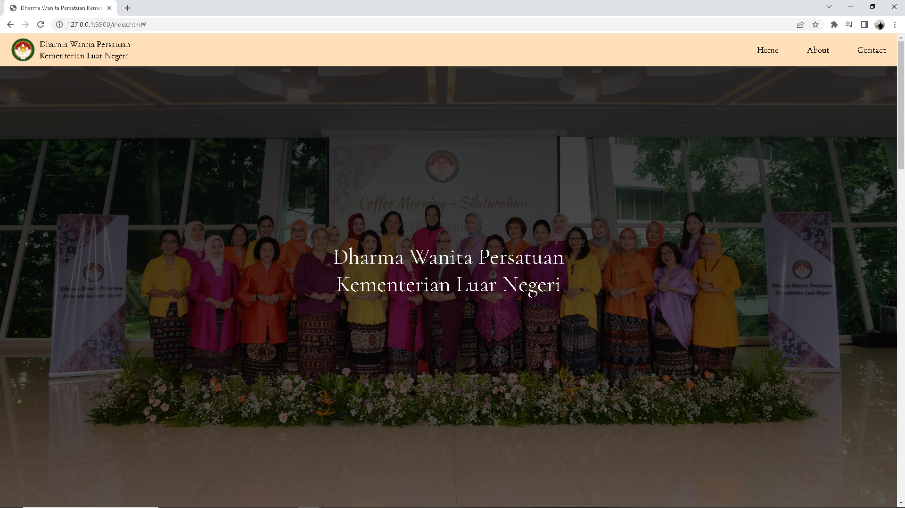
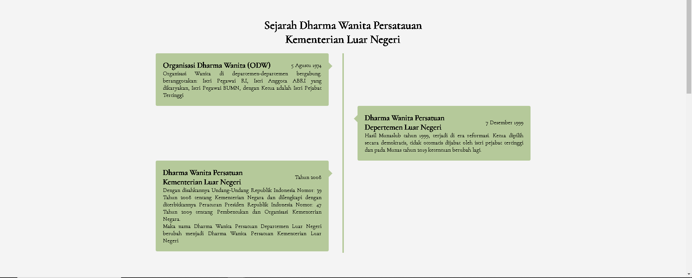
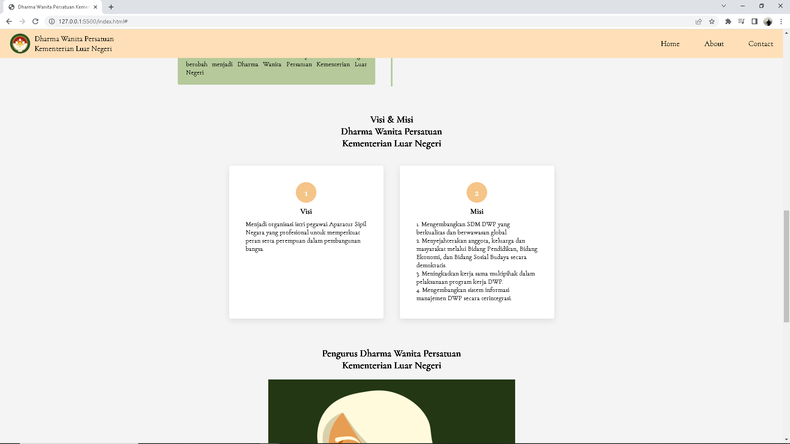
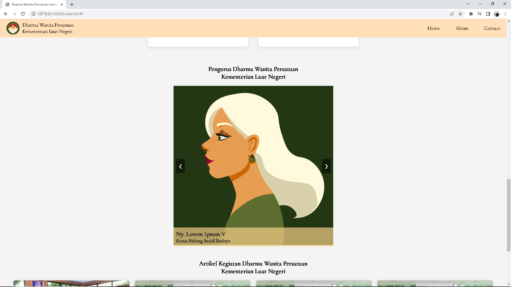
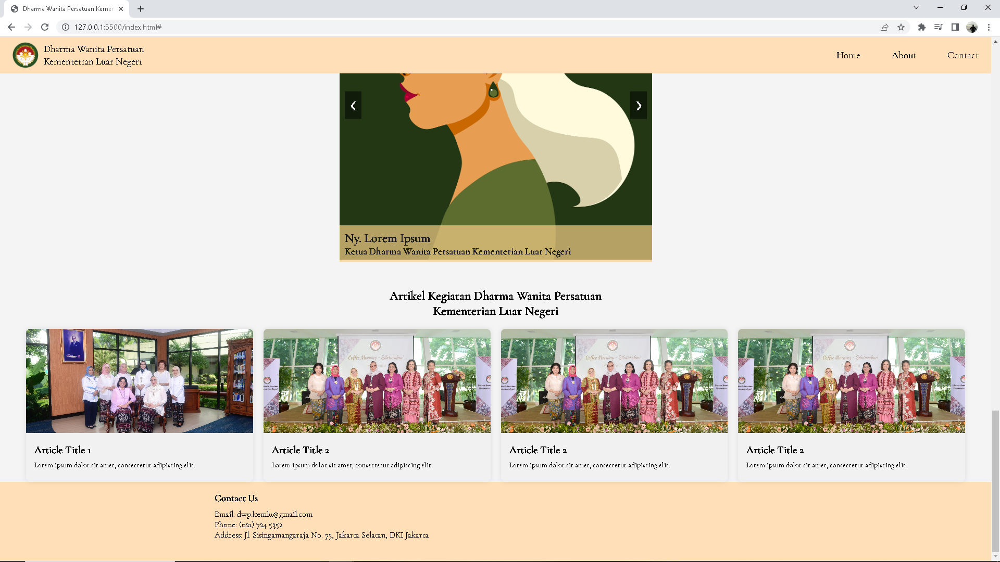

This documentation provides an overview of the structure and content sections typically found in a company profile website. It includes sections for the company's history, vision and mission, company management, and activity articles. 

<h1>Sections</h1>

1. Home: The homepage serves as an introduction to the company

2. About Us / Company History: This section provides a comprehensive history of the company. It highlights the company's growth, development, and important events that have shaped its identity.

3. Vision and Mission: This section outlines the company's vision, which represents its long-term aspirations and goals. It also includes the mission statement, which describes the purpose and core values that guide the company's operations.

4. Company Management: This section provides information about the key members of the company's management team.

5. Activity Articles: This section features news articles, blog posts, or updates about the company's recent activities, achievements, projects, or events. It provides insights into the company's current endeavors and showcases its expertise, innovation, and contributions to the industry.

<h1>License</h1>

This project is licensed under the MIT License.

<h1>Contact</h1>

If you have any questions or suggestions regarding the company profile website, please contact us at hilmifauzi06@gmail.com.

We appreciate your interest in our company profile website and look forward to your contributions!

